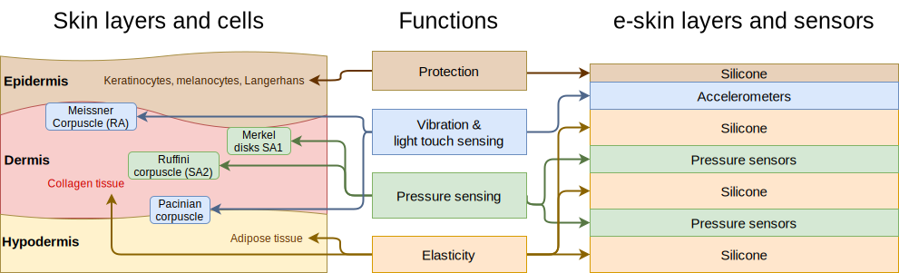

# Welcome

Thiiis is the home page for our _Modular and Scalable Soft e-Skin_ project. We draw inspiration from the layered structure of human skin to create a sensor array that can measure both normal and shear forces as well as vibrations in robotic applications. Our approach emphasises:

- **Modularity** – Easy to add or remove layers and sensors.
- **Scalability** – Straightforward to expand the sensor arrays with simplified electronics.
- **Accessibility** – Employing off-the-shelf components and standard silicone moulding.

Have a look at our **[project summary](/article)** for the main technical details, or head directly to the **[tutorial page](/tutorial)** to build your own!

